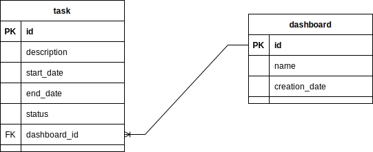

# **Readme**

## **Description**
Spring mvc with react application to manage a dashboard with TODO list:
- Create dashboard
- Create task
- Change task status

 

**Built with:**

- Java 11
- Spring boot
- JPA
- Maven 3.8.5
- React ^18.1.0

 

**Architecture:**

- MVC Architecture

 

## **Diagrams**

### Entity relationship diagram

 

 

## **Test solution**

**Local**

- Install Java 11
- Install maven 3.8.5
- Clone repository https://github.com/dianaCiro/SSR_react_springboot.git
- Configure IDE with Java 11 and maven3.8.5
- Import Project from IDE and build/run
- Using postman collection

